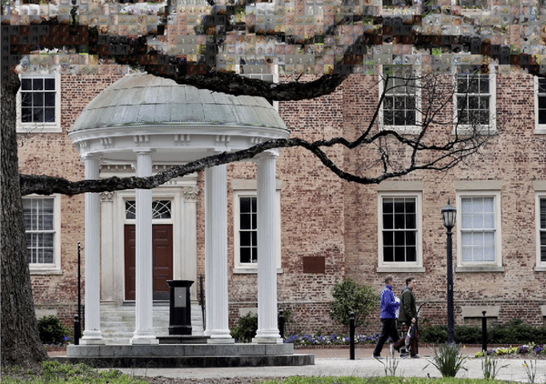
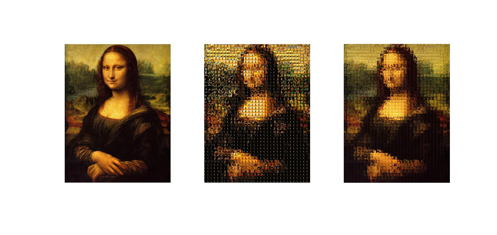
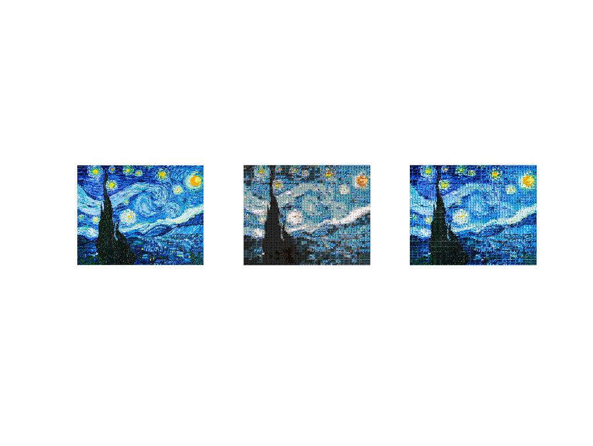
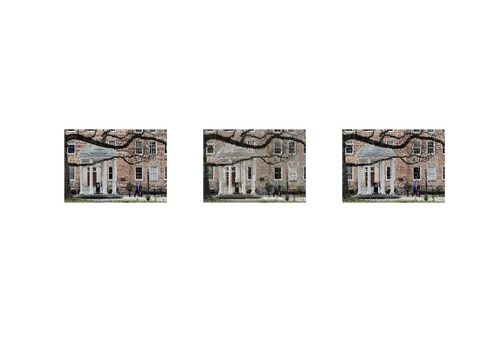
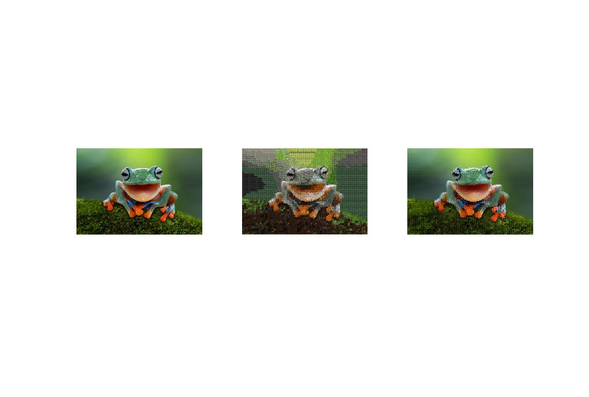
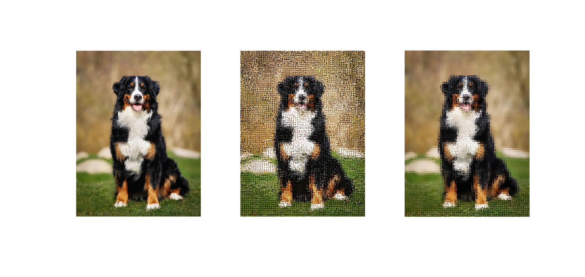

# Catsaics - Mosaics made using a Cat Dataset written in Matlab

---

Project uses ~5000 cat images from a kaggle dataset found [here](https://www.kaggle.com/crawford/cat-dataset)

## **Details** 

Given a target image, tile size and a image dataset in `main.md` the script will loop over the target image with a step size of tile size and get the best matching image from the dataset using either `SSD` or `Averaging with SSD`. Both methods yield different results so it's up the user to determine which is better for their needs. 

### Included are some samples 

**left image** : `Original` 

**middle image** : `Mosaic` 

**right image** : `Mosaic with histogram matching for color correction`

### Samples

